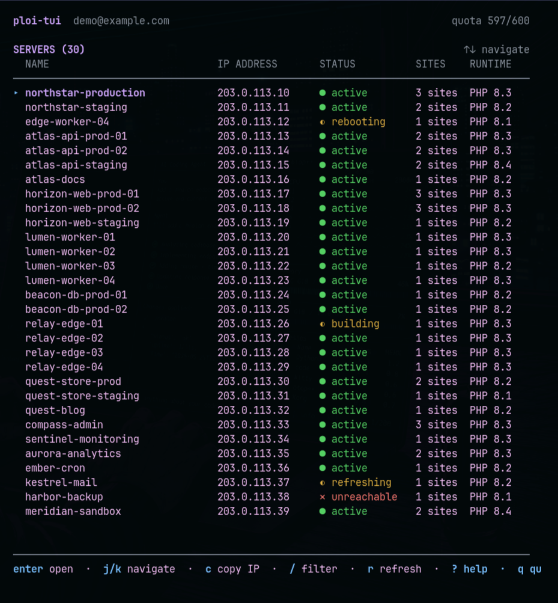
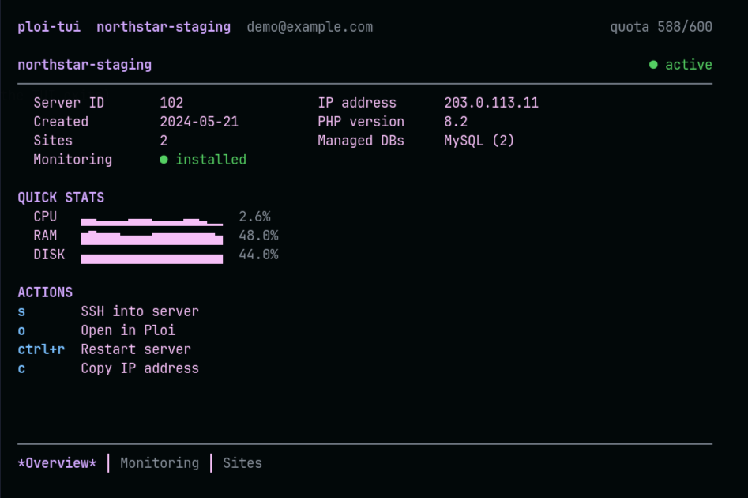
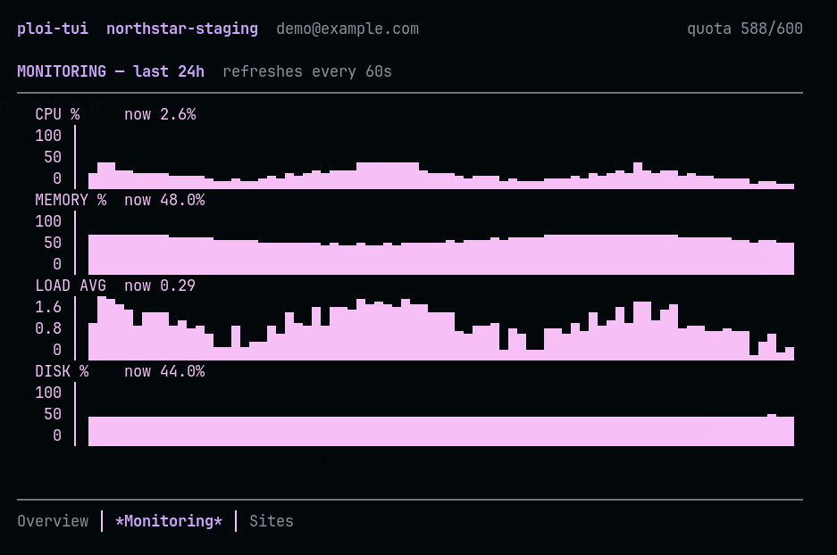
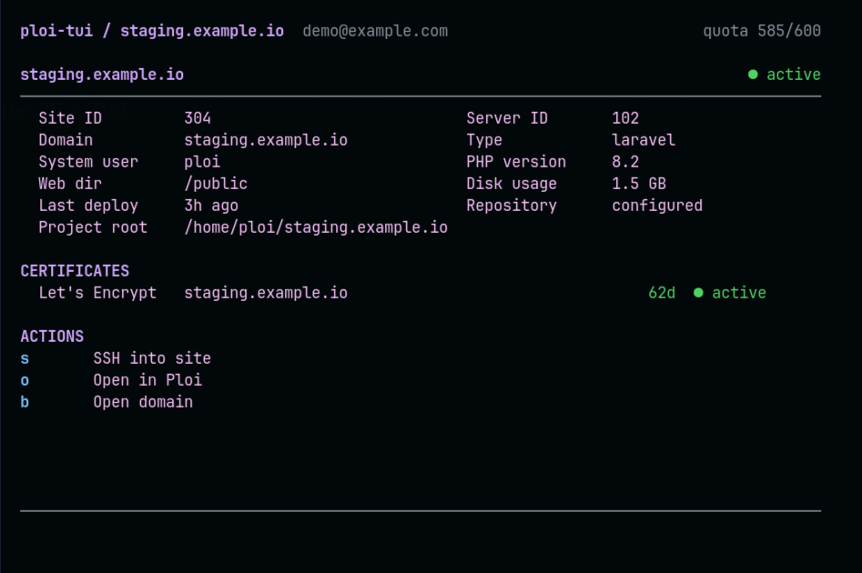

# ploi-tui

A lazygit-style terminal UI for managing [ploi.io](https://ploi.io) servers — browse servers, sites, monitoring and certificates, SSH in, restart servers, all without leaving your terminal.

Built with Go and the [Charm](https://github.com/charmbracelet/bubbletea) stack (Bubble Tea + Lip Gloss + Bubbles). Ships as a single static binary for **Linux and macOS** on **amd64 and arm64**.

## Screenshots

### Server list

Browse all servers with status badges, site counts and runtimes at a glance.



### Server overview

Quick CPU/RAM/disk stats plus SSH, restart and copy-IP actions.



### Monitoring

CPU, memory, load and disk charts for the last 24 hours, refreshing every 60s.



### Site details

Per-site info with deployment status and certificate expiry.



---

## Features

- Browse servers with status badges, filtering, and quick resource stats
- Server overview with IP, PHP/database info, and a link to the Ploi dashboard
- Monitoring view with CPU, memory, load, and disk charts (refreshes every 60s)
- Sites list with project/runtime/disk summaries and drill-down details
- Certificate status with color-coded expiry warnings
- SSH into a server using your system `ssh` client, config, and agent
- Restart servers via a confirmation flow with status feedback
- Fast startup from a local cache; live API results replace cached data
- Single static binary, no runtime dependencies

## Installation

### Quick install (Linux and macOS)

```bash
curl -sSfL https://raw.githubusercontent.com/pdaether/ploi-tui/main/install.sh | bash
```

This detects your OS and architecture (Linux/macOS on x86_64 or arm64), downloads the latest release, and installs `ploi-tui` to `/usr/local/bin` (falls back to `~/.local/bin` when that directory is not writable). Afterwards:

```bash
ploi-tui version
```

To install elsewhere:

```bash
curl -sSfL https://raw.githubusercontent.com/pdaether/ploi-tui/main/install.sh | INSTALL_DIR=~/.local/bin bash
```

To update to the latest release later, re-run the same command.

> macOS may warn that the binary is from an unidentified developer because it is not notarized. Right-click the file in Finder, choose **Open**, and confirm once. The install script already tries to clear the quarantine flag for you.

### Manual install

Download the archive for your platform from the [Releases page](https://github.com/pdaether/ploi-tui/releases). Check your architecture with `uname -m` (`x86_64` = amd64, `aarch64`/`arm64` = arm64):

| OS | Architecture | File |
| --- | --- | --- |
| Linux | x86_64 (Intel/AMD 64-bit) | `ploi-tui_Linux_x86_64.tar.gz` |
| Linux | aarch64 (ARM 64-bit, e.g. Raspberry Pi, AWS Graviton) | `ploi-tui_Linux_aarch64.tar.gz` |
| macOS | x86_64 (Intel Macs) | `ploi-tui_Darwin_x86_64.tar.gz` |
| macOS | aarch64 (Apple Silicon, M1 and newer) | `ploi-tui_Darwin_aarch64.tar.gz` |

#### Linux

```bash
# Pick the matching file from the table above (example: Linux x86_64)
curl -sSfL https://github.com/pdaether/ploi-tui/releases/latest/download/ploi-tui_Linux_x86_64.tar.gz \
  | tar xz
chmod +x ploi-tui
sudo mv ploi-tui /usr/local/bin/
# Without sudo, use ~/.local/bin instead (make sure it is on your PATH):
# mkdir -p ~/.local/bin && mv ploi-tui ~/.local/bin/

ploi-tui version
```

#### macOS

```bash
# Apple Silicon (M1 and newer)
curl -sSfL https://github.com/pdaether/ploi-tui/releases/latest/download/ploi-tui_Darwin_aarch64.tar.gz \
  | tar xz

# Intel Macs — use ploi-tui_Darwin_x86_64.tar.gz instead:
# curl -sSfL https://github.com/pdaether/ploi-tui/releases/latest/download/ploi-tui_Darwin_x86_64.tar.gz \
#   | tar xz

chmod +x ploi-tui
mv ploi-tui /usr/local/bin/

ploi-tui version
```

See the Gatekeeper note under Quick install if macOS blocks the binary.

### With Go

Requires Go 1.27 or newer:

```bash
go install github.com/pdaether/ploi-tui/cmd/ploi-tui@latest
```

### From source

```bash
git clone https://github.com/pdaether/ploi-tui
cd ploi-tui
make build    # binary lands in bin/ploi-tui
```

## Setup — connect to Ploi

`ploi-tui` needs a Ploi API token before it can talk to your account.

1. Create a token at <https://ploi.io/profile/api-keys>. It needs read access to servers, sites, and certificates — plus write access to servers if you want to use the restart action.
2. Store it:

   ```bash
   ploi-tui connect
   ```

   You are prompted for the token (input is hidden), it is validated against the Ploi API, and on success you see your account email/plan. The token is stored in your OS keyring; on systems without a keyring (e.g. headless Linux) it falls back to the config file with `0600` permissions.
3. Launch the UI:

   ```bash
   ploi-tui
   ```

   If no token is stored yet, the connect wizard starts automatically.

To sign out on the current machine:

```bash
ploi-tui logout   # removes the token from the keyring and the config file
```

Other commands:

```bash
ploi-tui version  # print version info
ploi-tui help     # help for any command
```

## Usage

### Keybindings

| Key | Action | Key | Action |
| --- | --- | --- | --- |
| `j` / `k`, `↑` / `↓` | navigate | `enter` | select / drill down |
| `esc` | back | `h` / `l`, `1-9` | switch tabs |
| `r` | refresh view | `R` | refresh all |
| `s` | SSH into server (or as site user on site detail) | `ctrl+r` | restart server (confirm) |
| `o` | open server/site in Ploi | `b` | open selected site domain |
| `c` | copy IP | `/` | filter |
| `?` | help overlay | `q` | quit |

### Configuration & data locations

| Purpose | Path |
| --- | --- |
| Config | `~/.config/ploi-tui/config.toml` |
| Cache | `~/.cache/ploi-tui/` |
| API token | OS keyring first; fallback to config file with `0600` permissions |

Secrets are never logged or written to the cache. The config directory is created with `0700`.

### SSH users

Press `s` on a server detail screen to load the system users configured in Ploi and select one to connect. The built-in `ploi` account is always available. If Ploi does not expose system users for a server, it connects as `ploi`. SSH uses your system client, so it respects your local SSH configuration and agent.

No SSH accounts or overrides are stored locally.

## Development

### Prerequisites

- **Go 1.27 or newer** — check with `go version`
- **make** (optional but convenient)
- **golangci-lint v2** — for linting ([install guide](https://golangci-lint.run/welcome/install/))

### Common tasks

```bash
make build      # compile ./cmd/ploi-tui into bin/ploi-tui (version injected from git tags)
make run        # build + start it
make test       # go test -race ./...
make vet        # go vet ./...
make lint       # golangci-lint run
make cover      # tests with coverage report
make cross      # manual cross-builds of every supported platform into dist/manual/
make clean      # remove build output
```

CI runs build, vet, tests (with `-race`), a cross-compile smoke test for all four platforms, and golangci-lint on every push/PR — keep those green locally with `make all`.

### Project layout

```
ploi-tui/
├── cmd/ploi-tui/            # entrypoint: root(→TUI), connect, logout, version
├── internal/
│   ├── config/              # load/save, XDG paths, permission checks
│   ├── api/                 # typed ploi client: retries, rate limits, pagination
│   ├── store/               # TTL cache (memory + disk)
│   └── ui/                  # Bubble Tea models: app, serverlist, serverdetail, components, …
├── .github/workflows/       # ci.yml (test/lint/cross-build), release.yml (goreleaser)
├── .golangci.yml            # linter configuration
└── .goreleaser.yaml         # release configuration (linux/darwin, amd64/arm64)
```

Releases are automated: pushing a tag like `v0.1.0` triggers the `Release` workflow, which publishes binaries (`tar.gz`) for Linux/macOS on amd64/arm64 plus checksums and a changelog.

### Code style

- Standard `gofmt`/`goimports` formatting (imports are grouped with the local prefix last); linters are configured in `.golangci.yml`.
- All builds use `CGO_ENABLED=0`; keep dependencies pure-Go so Linux and macOS keep working identically.

## Acknowledgements

- [ploi.io](https://ploi.io) — [API docs](https://developers.ploi.io/)
- [Charm Bubble Tea](https://github.com/charmbracelet/bubbletea), [Lip Gloss](https://github.com/charmbracelet/lipgloss), [Bubbles](https://github.com/charmbracelet/bubbles)
- Inspired by [lazygit](https://github.com/jesseduffield/lazygit)
